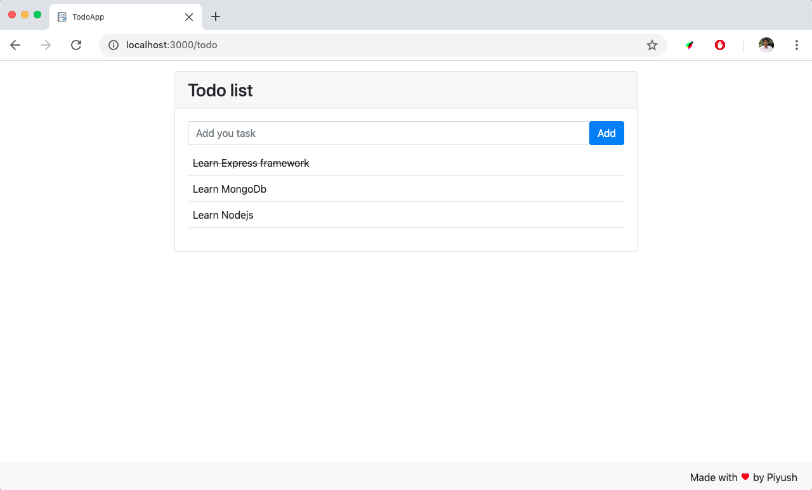

# Nodejs Todo Application
A basic application build by Nodejs, Express and MongoDb

To start server
1. Go to current directory
2. Execute this command `node app` or `nodemon app`

Screenshot of application

